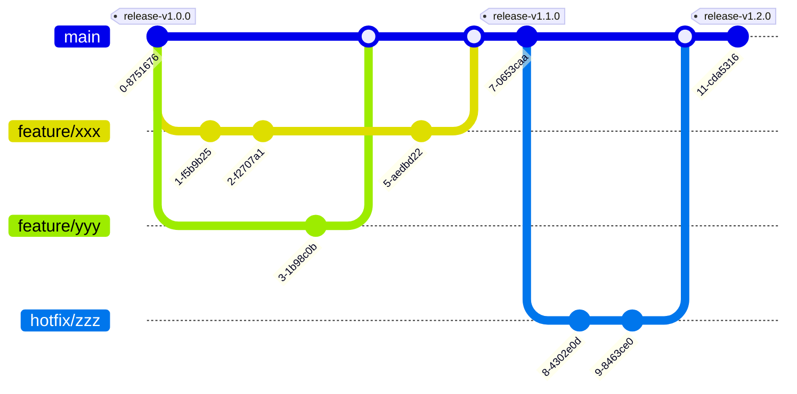

# Development Flow

## Branch Strategy

As shown in the diagram below, the feature branches (`feature/xxx`) are created from the `main` branch for development. The `main` branch is the release branch.



### Branch Naming

While there are no strict rules, the following naming conventions are recommended:

- `feature/xxx`: (xxx represents the feature being added)
- `bugfix/xxx`: (xxx represents the bug being fixed)
- `hotfix/xxx`: (xxx represents the urgent fix)

## Writing and Modifying Tests

Testing files are written in YAML format with the properties expected by [runn](https://github.com/k1LoW/runn).

To add a new scenario test:

1. Navigate to the `scenario-tests/` directory.
2. Determine the correct job category (e.g., `sampling-job`, `estimation-job`, `mp-job`, `sse-job`).
3. Add or modify the `.yml` files in the corresponding `runn/` subdirectory.

See [Adding New Tests](adding_new_tests.md) for more detailed instructions on creating tests.

## Running Tests Locally

Before submitting your changes, verify that the tests are working locally.

```shell
cd scenario-tests
```

List all available tests:

```shell
task runn-list
```

Run a specific test to verify execution (replace `<test-id>` with the desired ID):

```shell
task runn-id -- <test-id>
```

Run all tests if you modified shared includes:

```shell
task runn-all
```

## Conventional Commits

Commit messages should follow the [Conventional Commits](https://www.conventionalcommits.org/en/v1.0.0/) specification.

### Commit Message Format

```shell
git commit
# Overview (Uncomment one of the following templates)
#feat:
# └  A new feature
#fix:
# └  A bug fix
#docs:
# └  Documentation only changes
#style:
# └  Changes that do not affect the meaning of the code
#    (white-space, formatting, missing semi-colons, etc)
#refactor:
# └  A code change that neither fixes a bug nor adds a feature
#test:
# └  Adding missing or correcting existing tests
#ci:
# └  Changes to our CI configuration files and scripts
#chore:
# └  Updating grunt tasks etc; no production code change
```

Select the appropriate prefix and write your commit message:

```shell
docs: Update README.md
```

## Correspondence between Commit Messages and Labels

When a pull request is opened, labels are automatically assigned based on the commit message prefix.
Below is the correspondence between prefixes and labels:

| Prefix | Label | Description |
|---|---|---|
|feat: | `feature` | Adding a new feature |
|fix: | `bugfix` | Bug fixes |
|docs: | `documentation` | Documentation only changes |
|style: | `style` | Changes that do not affect the meaning of the code (white-space, formatting, missing semi-colons, etc) |
|refactor: | `refactor` | Code changes that neither fix a bug nor add a feature |
|test: | `test` | Adding or correcting existing tests |
|ci: | `ci` | Adding or updating CI configuration and scripts |
|chore: | `chore` | Minor changes or maintenance tasks |

## CI

This project uses GitHub Actions to automate checks and repository management.

### Automated Checks

On pull requests, the following checks are automatically executed:

- scenario tests (runn)
- documentation build (mkdocs)

Ensure that all checks pass before merging.

### Labeling

Labels are automatically assigned to pull requests targeting the default
branch based on the commit message prefix (see [Conventional Commits](#conventional-commits)).

## Submitting a Pull Request

Push your feature branch and create a Pull Request against the `main` branch.
Wait for CI checks to complete, and request review from the maintainers. Once
approved, the changes will be merged into `main`.
