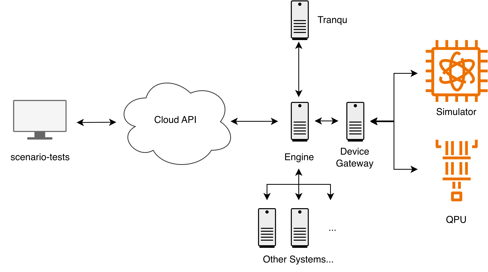

# Scenario Test Suite

This is a tool for operating the entire system using the OQTOPUS Cloud API and conducting integration tests based on predefined scenarios. It was developed to verify the end-to-end behavior of the system.

## Execution Method and Test Characteristics

- Test scenarios, written in YAML format, are executed using the `runn` tool.
- It supports running multiple scenarios in parallel or sequentially, as well as selecting and running specific scenarios only.
- Since these tests are executed from outside the OQTOPUS Cloud API, they are classified as black-box tests that verify the API's behavior rather than directly validating the system's internal operations.
- Unlike E2E tests, these tests do not involve operations through a user interface (UI).
- The prerequisites for each test scenario (such as topology, gate set, etc.) are detailed in the `README.md` file within each respective category folder.



## Overview

This directory contains scenario tests for Oqtopus system job execution using the [runn](https://github.com/k1LoW/runn) testing framework. The tests verify that quantum jobs complete with expected statuses (`succeeded` or `failed`) across various job configurations and parameter combinations.

## Prerequisites

Before running the tests, ensure you have the following:

- [runn](https://github.com/k1LoW/runn) installed
- [Task](https://taskfile.dev/) installed (for running Taskfile.yml commands)
- A `.env` file in the scenario-tests directory with required environment variables

## Environment Variables

Create a `.env` file in the scenario-tests directory with the following variables:

```bash
# API Configuration
USER_API_ENDPOINT="<your-api-endpoint>"
Q_API_TOKEN="<your-api-token>"
```

USER_API_ENDPOINT should point to your Oqtopus Cloud User-API endpoint, and it must be a full URL including the protocol like https or http.
Q_API_TOKEN should be your authentication token for accessing the API.

**Note**: The `.env` file should not be committed to version control as it contains sensitive information.

## Project Structure

```text
scenario-tests/
├── Taskfile.yml           # Task runner configuration
├── .env                   # Environment variables (not tracked in git)
├── include/
│   └── post.yml          # Common test steps for job submission and polling
├── estimation-job/       # Estimation job type tests
│   ├── README.md
│   └── runn/
├── mp-job/              # Multi-Programming job type tests
│   ├── README.md
│   └── runn/
├── sampling-job/        # Sampling job type tests
│   ├── README.md
│   └── runn/
└── sse-job/             # SSE job type tests
    ├── README.md
    └── runn/
```

## Usage

### Available Commands

The following commands are available via the Taskfile.yml:

#### List Available Tests

```bash
task runn-list
```

Lists all available runn test files with their descriptions.

#### Run Specific Test by ID

```bash
task runn-id -- <test-id>
```

Runs a specific test identified by its ID. Replace `<test-id>` with the actual test identifier which can be found in the output of `task runn-list`.

Example:

```bash
task runn-id -- 8f57278
```

#### Run All Tests Sequentially

```bash
task runn-all
```

Executes all tests in sequence, one after another. This is safer but takes longer.

#### Run All Tests Concurrently

```bash
task runn-all-con
```

Executes all tests concurrently with a maximum of 8 parallel processes. This is faster but may put more load on the target system.

## Test Categories

- [Device](./device/README.md)
- [Estimation Job](./estimation-job/README.md)
- [Multi-Programming (MP) Job](./mp-job/README.md)
- [Sampling Job](./sampling-job/README.md)
- [SSE Job](./sse-job/README.md)

### Sampling Job Tests

Located in `sampling-job/`, these tests verify sampling job execution across various parameter combinations including:

- Different transpilers (qiskit, no transpiler, default transpiler)
- Mitigation settings (on/off)

### Estimation Job Tests

Located in `estimation-job/`, these tests verify estimation job execution with similar parameter combinations as sampling jobs.

### Other Job Types

- **MP Job Tests** (`mp-job/`): Located in `mp-job/`, these tests verify MP job execution.
- **SSE Job Tests** (`sse-job/`): Located in `sse-job/`, these tests verify SSE job execution.
